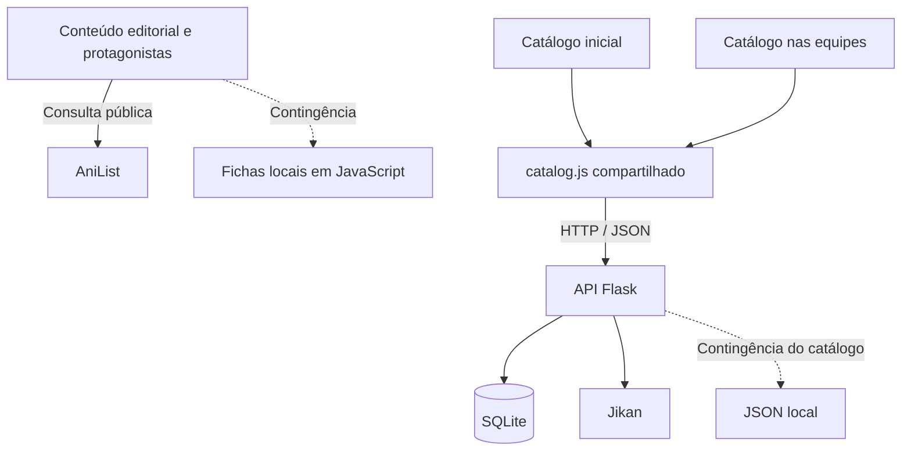

# Arquitetura — JoJo integrado

## Fluxos

O Flask serve todas as páginas. O catálogo da página inicial e o de equipes consultam a mesma API Python/Jikan através de `catalog.js`. A AniList fornece conteúdo editorial e biografias opcionais, sem definir a lista selecionável. As regras e a persistência das equipes continuam no Python/SQLite. Consultas públicas não recebem nomes de equipes nem histórico.

## Arquivos

| Caminho | Responsabilidade |
| --- | --- |
| `app.py` | Rotas HTML/API; validações, snapshots e rollback. |
| `database.py` | Conexão SQLite por requisição e inicialização do esquema. |
| `schema.sql` | Tabelas e índices; igual à versão Python anterior. |
| `jojo_client.py` | Jikan, normalização, cache e fallback. |
| `data/fallback_characters.json` | Catálogo de equipes sem API. |
| `templates/_header.html` | Menu compartilhado. |
| `templates/index.html` | Hero, sinopse, temporadas, elenco e detalhes. |
| `templates/protagonistas.html` | Fichas dos protagonistas. |
| `templates/equipes.html` | Catálogo, formação, histórico e diálogos. |
| `static/css/style.css`, `protagonistas.css` | CSS recebidos no ZIP, preservados como base. |
| `static/css/integracao.css` | Navegação, acessibilidade e responsividade. |
| `static/css/equipes.css` | Estilo da área de equipes. |
| `static/js/site.js` | Menu, imagens e consultas AniList com timeout. |
| `static/js/catalog.js` | Fonte, busca e seleção de parte compartilhadas entre início e equipes; link da ficha para a equipe. |
| `static/js/script.js`, `protagonistas.js` | Consultas e renderização do guia e das fichas. |
| `static/js/archive-fallback.js` | Fichas mínimas locais. |
| `static/js/app.js` | Estado da interface de equipes e comandos à API Flask. |
| `instance/jojo_team_builder.db` | Banco criado na execução; não acompanha o ZIP. |
| `tests/test_app.py` | Regressões das funcionalidades e da persistência. |
| `tests/catalog.test.cjs` | Testes do módulo compartilhado, sem dependências npm. |

## Consistência do catálogo

As duas telas chamam `/api/catalog/parts` e `/api/catalog/characters?part=...`. A lista retornada não sofre corte nos primeiros 24 registros; o mesmo filtro por nome/Stand é aplicado por `JojoCatalog.filter()` nas duas páginas. `JojoCatalog.teamUrl()` carrega a parte e o nome para a busca na tela de equipes.

`JojoCatalogClient` mantém o cache por parte durante a execução. Um lock por parte impede que duas requisições simultâneas produzam fontes diferentes na primeira consulta. A contingência vem do mesmo JSON Python para as duas telas. As fichas editoriais locais não são usadas como uma segunda lista de personagens selecionáveis.

A base externa pode mudar entre reinicializações do servidor. Equipes e snapshots mantêm seus dados históricos; a unificação não reescreve esses registros.

## Banco

| Tabela | Dados |
| --- | --- |
| `teams` | `id`, `name`, `leader_character_id`, `current_version`, `created_at`, `updated_at`. Equipe atual. |
| `team_members` | Membros atuais: identificador, nome, URL da imagem, Stand, parte, papel e posição. |
| `team_versions` | `team_id`, `version_number`, `action`, `reason`, `snapshot_json`, `created_at`. Histórico. |

Há unicidade de `(team_id, version_number)` nas versões e chave `(team_id, character_id)` nos membros. As consultas SQL usam parâmetros.

Dados textuais e URL da imagem são copiados para a equipe e para os snapshots; o arquivo da foto não é armazenado. Snapshots antigos não dependem de consultar a Jikan novamente. Os identificadores anteriores são preservados; IDs AniList não os substituem.

## Atual, anterior e snapshots

`save_version()` incrementa `teams.current_version`, chama `serialize_team()` e guarda a equipe completa em `snapshot_json`, com ação, motivo e data. A atualização e o snapshot são confirmados na mesma transação SQLite com `commit()`.

A interface recebe `currentVersion`. A anterior é `currentVersion - 1`, porque a numeração começa em 1, cresce sequencialmente por equipe e o rollback não apaga registros. V1 não tem anterior.

O histórico vem em ordem decrescente. A interface marca **Atual** e **Anterior**. Abrir uma versão mostra nome, formação, posições, Stands e líder antes da restauração.

## Rollback

`rollback_team()` lê o snapshot escolhido, repõe nome e líder, substitui os membros atuais pelos membros salvos e cria outra versão com `action = "rollback"`. Os snapshots existentes permanecem. O `commit()` confirma o estado restaurado e a nova versão juntos.

Restaurar V2 quando a atual é V4 cria **V5**. A anterior da V5 é **V4**; **V2** é a fonte da restauração. É rollback do estado da aplicação baseado em snapshots, diferente do comando SQL `ROLLBACK`, que desfaz uma transação não confirmada.

## Endpoints

| Método | Caminho | Função |
| --- | --- | --- |
| GET | `/`, `/index.html` | Guia da saga. |
| GET | `/protagonistas`, `/protagonistas.html` | Protagonistas. |
| GET | `/equipes` | Team Builder. |
| GET | `/api/health` | Disponibilidade. |
| GET | `/api/catalog/parts` | Partes do catálogo de equipes. |
| GET | `/api/catalog/characters?part=3&q=Jotaro` | Personagens e fonte dos dados. |
| GET / POST | `/api/teams` | Listar / criar equipes. |
| GET / PUT | `/api/teams/{id}` | Ler / alterar nome ou líder. |
| POST | `/api/teams/{id}/members` | Adicionar personagem. |
| DELETE | `/api/teams/{id}/members/{characterId}` | Remover personagem. |
| PUT | `/api/teams/{id}/members/order` | Reordenar; endpoint anterior preservado, sem controle visual de ordenação. |
| GET | `/api/teams/{id}/history` | Histórico completo. |
| GET | `/api/teams/{id}/history/{version}` | Snapshot. |
| POST | `/api/teams/{id}/rollback/{version}` | Restaurar e gerar nova versão. |

## Persistência e limites

- É possível reutilizar o banco anterior copiando `instance` com os servidores parados; veja o README.
- `localStorage["jojo-active-team"]` guarda a última equipe selecionada e `jojo-catalog-part` guarda a parte. Limpar o navegador não apaga o banco.
- Salvar o mesmo nome ou definir o mesmo líder não cria uma alteração.
- A interface bloqueia comandos simultâneos durante uma gravação e descarta respostas antigas ao trocar rapidamente o filtro do catálogo.
- Uso local acadêmico, sem autenticação ou publicação. Não há coordenação de edições concorrentes entre vários usuários.
